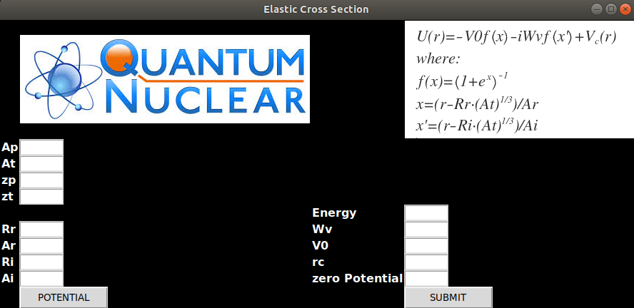
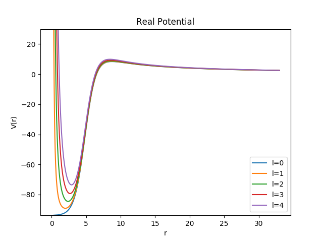
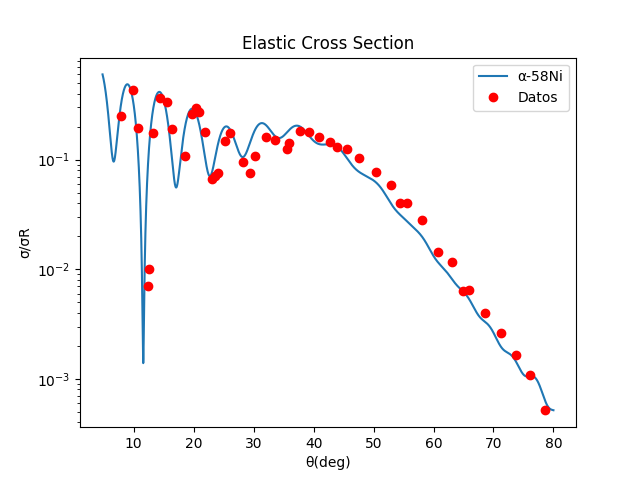
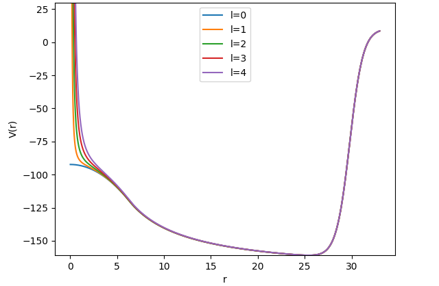
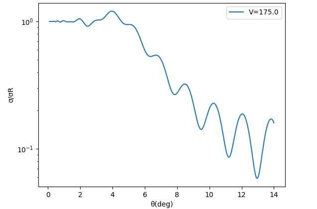
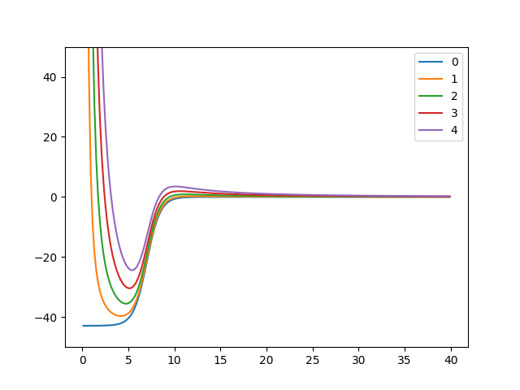
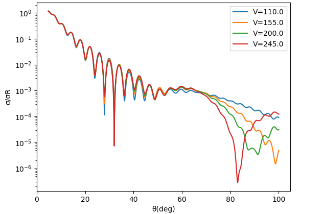

# Thesis-degree-of-physics-Python

In this repository is exposed my bacheor degree physics thesis([FaceInterfaz](Thesis.pdf))

The interface looks like 

Here are also some result for some Elastic Cross Section:

## Aplha particle - 58Ni

## 12C - 90Zr

## Alpha particle - 208Pb

